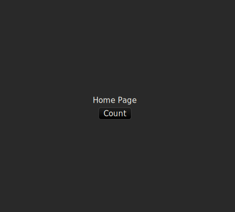
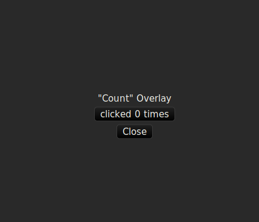
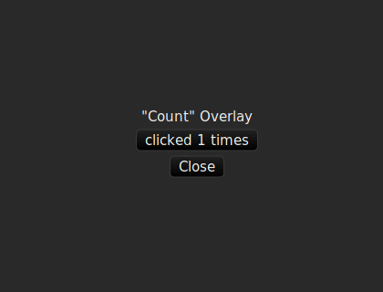

This project simulates a home page and an "overlay" which is a simple counter to demonstrate multiple clicks being suppressed.

Here's the home page:

You can click "count" to see the overlay:

But you can't click on it.

If you toggle [these two lines](https://github.com/justinmoon/druid-enums-bug/blob/master/src/main.rs#L44) in the source code so that the modal is displayed initially, then the modal will allow you to click once but subsequent clicks are suppressed.

